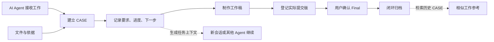

<h1 align="center">Office Workbench</h1>

<p align="center">
  <strong>给 AI Agent 一个能长期工作的个人办公室。</strong>
  <br />
  装好你需要的 Skill / MCP，打开同一个项目目录；换会话、换 Agent，工作仍有依据可以继续。
</p>

<p align="center">
  <a href="https://github.com/zhihuigu/office-workbench/releases/tag/v0.1.0-rc1"></a>
  <a href="LICENSE"></a>
  
  
</p>

<p align="center">
  <a href="#三步开始">三步开始</a> ·
  <a href="demo/README.md">完整演示</a> ·
  <a href="docs/daily-use.md">日常使用</a> ·
  <a href="docs/privacy.md">隐私说明</a>
</p>

---

## AI 会干活，还需要一个长期工作区

AI Agent 可以分析和生成内容，Skill 告诉它具体怎样做，MCP 让它访问文件、邮件和其他工具。但这些能力本身不会自动形成一个长期、可信的办公现场。

每来一件工作就临时建目录、重新上传材料、再解释一遍规则，短期能完成任务，长期会逐渐遇到几个问题：上次做到哪里、哪个版本真的提交过、自己手工改的是哪份、相似工作以前怎样处理。

Office Workbench 补的是这一层：**把 AI、能力和真实工作组织进同一个项目目录。**

| 组成部分 | 负责什么 |
|---|---|
| **AI Agent** | 理解要求、判断、规划和制作内容 |
| **Skill** | 提供周报、表格、文档等具体做法 |
| **MCP / 工具** | 读取邮件、录音、Office 文件或外部系统 |
| **Office Workbench** | 保存事项、依据、进度、版本、历史和下一步 |

> **Agent 可以换，模型可以换，Skill 和 MCP 可以按需增加；只要它能读取这个工作区，事情就不必重新从聊天记录里开始。**

## 它不绑定某一个 AI

核心工作台由项目规则、Markdown 文件和本地 Python 脚本组成，不调用固定模型 API，也不依赖某个 AI 账号。

一个 AI Agent 只要具备以下能力，就可以接入核心工作台：

1. 把私人工作台作为项目目录打开；
2. 读取项目规则和现有文件；
3. 在该目录运行本地 Python 命令；
4. 按实际需要使用你已经安装并授权的 Skill、MCP 或文件工具。

当前公开候选使用 **Codex + `AGENTS.md`** 完成了会话层验证。其他 Agent 的规则发现方式、Skill 格式和 MCP 配置可能不同，需要按对应产品建立入口并自行验证；工作数据和核心命令不因此绑定 Codex。

## 一次工作怎样留下来



每个 CASE 都有独立目录，原始依据、过程文件和成果分开放置。CASE 是事项事实源，看板和索引可以重新生成。

```text
ACTIVE/某个事项/
├─ CASE.md          # 要求、状态、下一步、版本位置
├─ sources/         # 原始依据
├─ work/            # 工作过程与草稿
└─ deliverables/    # 提交版和成果
```

## 平时只需要正常说话

不必先学命令，也不必记住 CASE、UUID 或状态字段。你主要负责交代事实、补充材料和确认重要结果。

```text
第一次：帮我筹备“云朵书屋读书交流会”。先查重并建立事项，下一步拟一份议程。

几天后：接着上次那个读书交流会做，先告诉我当前进度和下一步。

手工修改后：我已经改过议程 V1，以磁盘上的文件为准，继续完善，先给我审阅。

确认采用版：这份 V2 确认为 Final，活动还没结束，暂时留在在办。
```

AI Agent 负责理解你的表达、制作材料并维护记录；你安装的 Skill / MCP 提供专项能力和数据入口；本地 Python 脚本负责查重、状态更新、版本登记、检索、校验、归档和备份等可重复操作。

## 它能帮你留下什么

<table>
  <tr>
    <td width="50%" valign="top">
      <strong>🧭 事项连续性</strong><br /><br />
      保存要求、截止、当前进度、下一步和等待对象。新会话或新的 Agent 先取得任务上下文，再继续办理。
    </td>
    <td width="50%" valign="top">
      <strong>📄 文件版本可信度</strong><br /><br />
      区分 current、submitted 和 verified Final。Final 确认后记录 SHA256，发现文件变化时不再把它当作可信最终版。
    </td>
  </tr>
  <tr>
    <td width="50%" valign="top">
      <strong>🔎 历史与周期</strong><br /><br />
      检索历史 CASE，区分“确实没找到”和“扫描不完整”。用 SERIES 组织周报、月报等重复事项。
    </td>
    <td width="50%" valign="top">
      <strong>📦 本地可迁移</strong><br /><br />
      不需要服务器、数据库、向量库或后台进程。私人工作目录可以检查、备份并恢复到另一位置。
    </td>
  </tr>
</table>

## 三步开始

### 1. 准备环境

- 已有能读取项目文件并执行本地命令的 AI Agent；
- 本机有 Python 3.12 或以上；
- 下载本仓库或 [v0.1.0-rc1 Release](https://github.com/zhihuigu/office-workbench/releases/tag/v0.1.0-rc1)。

核心功能不需要本项目专用 API key、pip 包、Node、Office 或 Git。你所选择的 AI Agent、Skill 和 MCP 仍按各自方式安装、登录和授权。

### 2. 建立私人工作目录

在仓库目录的 PowerShell 中运行：

```powershell
python -I -B .\workbench.py init --workspace "$env:USERPROFILE\MyOffice"
```

它会在代码仓库之外建立一个新的私人目录。公开代码和日常材料从一开始就分开放置。

```text
你的某个父目录/
├─ office-workbench/     # 可公开的代码，不放真实工作材料
└─ MyOffice/             # 私人工作目录，日常让 AI Agent 打开这里
   ├─ AGENTS.md、LOCAL.md、office.py
   ├─ ACTIVE/、ARCHIVE/、SERIES/、KNOWLEDGE/
   ├─ INBOX/、INDEX/、DERIVED/、工作看板.md
   └─ .office-system/    # 独立运行时与本地手册
```

### 3. 让 AI Agent 完成自检

在你的 AI Agent 中打开 `MyOffice`。如果它支持 `AGENTS.md`，可以直接新建会话后说：

> 请读取 AGENTS.md 和 LOCAL.md，运行 python -I -B office.py doctor，确认这是一个新工作台，然后告诉我怎么交代第一件事。不要创建示例任务。

如果它不自动识别 `AGENTS.md`，请按照该 Agent 的项目规则机制引用这份规则，或者在会话开始时明确让它读取。完成后就可以正常交代第一件工作。更详细的目录选择、预览命令和当前已验证的 Codex 流程见[初始化指南](docs/quickstart.md)。

## 为什么会越用越顺

刚初始化的工作台是空的，它不会立刻了解你的工作。随着你持续办理事项：

1. 相关材料和处理过程会留在对应 CASE 中；
2. 相似工作可以检索以前的事项和最终采用版；
3. 重复工作可以共享稳定的 SERIES 说明；
4. 经你确认的长期经验可以进入知识层，成为以后工作的依据。

所以它带来的变化不是“第一次什么都不用教”，而是**重要背景不用永远困在某一次聊天里**。

## 核心范围与扩展能力

| 能力 | 本仓库是否包含 | 说明 |
|---|---:|---|
| CASE、看板、状态、版本、历史检索 | ✅ | Python 核心、项目规则与模板 |
| 自然语言交代工作 | ✅ | 由能读取项目规则、运行本地命令的 AI Agent 执行 |
| 初始化、检查、备份、恢复、升级 | ✅ | 私人目录与代码目录保持分离 |
| Word、Excel、PDF、PPT 读写 | ➕ | 给 Agent 安装或连接相应 Skill / 工具 |
| 邮件、附件、钉钉录音等接入 | ➕ | 给 Agent 配置相应 MCP / 连接器并明确授权 |
| Office 附件正文全文索引 | ⏳ | 当前尚未实现 |
| 团队审批、定时提醒、后台通知 | — | 不属于当前候选范围 |

`➕` 表示工作台可以保存这些材料及其版本，但不捆绑对应连接器。完整说明见[接入边界](docs/integrations.md)。

## 文档导航

| 你想做什么 | 从这里开始 |
|---|---|
| 从零安装并完成第一轮自检 | [快速开始](docs/quickstart.md) |
| 学习平时怎样向 AI 交代工作 | [日常使用](docs/daily-use.md) |
| 体验一个完整的虚构任务 | [文字演示](demo/README.md) |
| 理解状态、手工修改和历史找回 | [任务与文件](docs/files-and-history.md) |
| 备份、迁移、升级和故障处理 | [维护手册](docs/maintenance.md) |
| 查看参数、退出码和检索协议 | [命令参考](docs/commands.md) |
| 了解数据、权限和网络边界 | [隐私说明](docs/privacy.md) |
| 查看设计和当前验证范围 | [架构](docs/architecture.md) · [支持范围](SUPPORT.md) |

## 当前版本与验证范围

当前为 `0.1.0-rc1` 公开预览版。最低要求为 Python 3.12；核心脚本现有完整验证环境为 **Windows、Python 3.14.6、PowerShell 和本地磁盘**，会话层使用 Codex 验证。macOS、Linux、其他 AI Agent、其他 Python/Windows 组合、网络盘和多机协作尚未完成实机验证。

你可以在代码目录运行公开测试和发布检查：

```powershell
python -I -B .\tests\run.py
python -I -B .\tools\release.py check
```

私人数据保存在你的文件目录里，**这不等于 AI 推理完全离线**。本地脚本不访问网络；你使用的 Agent、模型、Skill、MCP 和连接器遵循各自的数据与权限设置。放入真实材料前，请先阅读[隐私说明](docs/privacy.md)和[安全说明](SECURITY.md)。

## 参与与反馈

- 遇到问题，请提交不含真实办公信息的 [Issue](https://github.com/zhihuigu/office-workbench/issues)；
- 欢迎提供虚构复现步骤、改进建议和 Pull Request，具体见[贡献指南](CONTRIBUTING.md)；
- 感谢 [LINUX DO](https://linux.do/) 社区提供交流、反馈与公开测试的环境。

当前项目采用 [MIT 许可证](LICENSE)，版权署名为 zhihuigu。适用边界见[许可证说明](LICENSE-STATUS.md)。本项目与 OpenAI 或其他 AI 产品厂商无隶属关系。
